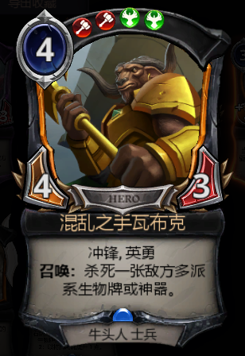
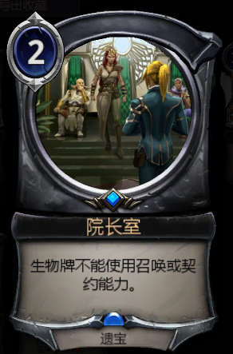
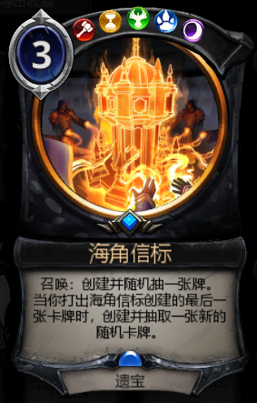
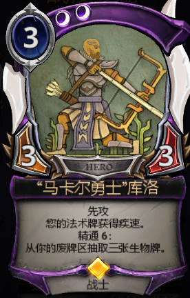
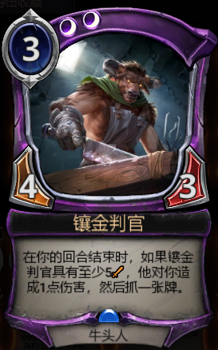

# 新手福利
新手福利是给新手积累原始资本用的，防止新手打不过别的玩家（
## 残局
差不多 $6000$ 金币，怎么打问问群友或者自己去摸索去熟悉机制就行了。
## 邀请好友
1. 雪人卡组
1. $3$ 包卡包
1. 旺普头像
1. $4$ 张闪谋取权能（灰卡）
1. 轮抽券 $1$ 张
1. $4$ 张闪外交印章（绿卡）
1. $3$ 包卡包
1. 尼拓洽贾安头像
1. $4$ 张闪并肩作战（蓝卡）
1. 轮抽券 $1$ 张

同时如果你是被邀请的玩家你可以获得 $3$ 包卡包，所以注册的时候务必问群友要个注册链接！
## 新手任务
一定要做完哦，不然不会刷出正常的任务。  
有些时候会有主题卡组，到了那天会送你套卡组（然而比较差）。  
同时第一次进入轮抽会送 $1$ 张轮抽券。
# 对战机制
## 卡组限制
主卡组 $[75,150]$ 张卡，权能数量要求 $[\frac13$,$\frac23]$，同张卡最多 $4$ 张（不管是什么稀有度）。  
市场中的卡要求与主卡组和市场本身互不相同，每张卡限 $1$ 张，最多塞 $5$ 张。特殊的，印记可以放在市场里。
## 卡牌类型
如果名字中带快速，比如快速法术，快速遗宝，就代表任何时候都可以打出（其实也不是任意的说）。
### 权能
打出可以获得对应的影响力和 $1$ 点最大权能。  
在你的回合开始时，你的权能会等于你的最大权能。
### 生物
支付费用，具有攻击力与生命值，生命值为 $0$ 死亡，攻击力	低于 $0$ 时无法攻击。  
单位攻击时单位力量按攻击方的意愿分配给由敌方选择防守的多个单位，然后攻击单位承受所有防守单位的力量的伤害。  
比如你场上有 7/7，5/6 和 3/3 可以攻击，对面场上 5/3 和 3/5，你选择 7/7 和 5/6 攻击，对面就可以用 5/3 和 3/5 一起阻挡你的 7/7，而你的 7/7 可以选择灭掉 5/3，把 3/5 造成 4 点伤害，也可以灭掉 3/5，把 5/3 造成 2 点伤害，同时你的 5/6 打的是对面的脸。另外，所有随从会在回合结束时恢复所有生命值。  
所有随从打出时是准备状态，但是本回合无法攻击，下个对手回合可以选择防御，如果一个随从攻击或防御，直到你的下个回合开始时处于消耗状态。在你的回合开始时准备状态，可以选择攻击，也可以不攻击去防御对手可能的攻击。  
这个机制能够保证满场的小怪可以防止对面大怪进攻，多换一；也可以满场小怪一起攻击，因为一个怪只能阻挡对面一个怪，不能一防多，可以多防一；还可以拿小怪暂时挡挡大怪，维护自己的血量。  
我写的什么乱七八糟，我自己都快看不懂，但是就是这样的。
### 法术
就是法术，打出有一定效果。
### 附属
#### 武器
给生物打出，使其强化攻击力生命值，还有些额外效果。
#### 遗宝
对己方英雄生效，获得一些额外效果。
#### 被诅咒的遗宝
对地方英雄生效，获得一些额外效果。
#### 遗宝武器
具有攻击力和护甲值，护甲值归 $0$ 时摧毁，摧毁时护甲值归 $0$。每回合可以选择一个敌方角色攻击，其受到该武器攻击力的伤害，己方玩家受到其攻击力的伤害。无法攻击地点，敌方有随从时无法攻击敌方玩家。另外，遗宝武器的战斗技能会使玩家的法术具有。
### 地点
地点的优先级是和玩家相同的，不可用地点去阻挡攻击，敌方玩家攻击时可以选择进攻己方地点还是己方玩家。
地点只具有生命值，生命值归 $0$ 破坏。在地点打出的那个回合和之后每个回合开始你都必须从地点中选择一张法术释放。所有法术释放完后再次释放会召唤出一个（强大的）生物，召唤后地点并不会被破坏。  
每个玩家最多控制 $1$ 个地点，可以用手牌中的地点去替换场上的地点，被替换的地点进入废牌区。
## 其他机制
开始时抽 $7$ 张手牌（随机抽的）。  
可以选择调度，保证调度后权能数量是 $[2,4]$。  
如果是 PvP 还可以再调度一次，抽 $6$ 张手牌，保证调度后权能数量是 $[2,4]$。  
回合开始时抽 $1$ 张牌，先手的第一个回合除外。  
抽牌时如果无牌可抽直接判负。
# 资源使用
## 卡包
$1000$ 金币可以买包卡包，一包卡包保底 $8$ 张白卡 $3$ 张绿卡 $1$ 张蓝卡，蓝卡 $10\%$ 变成橙色，也就是说一包卡包分解掉至少 $238$ 尘，此外，你开一包卡包还会额外送你 $100$ 尘。  
白色，普通，合成 $50$ 尘，分解 $1$ 尘。  
绿色，非凡，合成 $100$ 尘，分解 $10$ 尘。  
蓝色，稀有，合成 $800$ 尘，分解 $200$ 尘。  
橙色，传说，合成 $3200$ 尘，分解 $800$ 尘。  
但是永远不推荐买卡包，永远！许多另外的办法，性价比都比卡包高。  
卡包的其他获得方式是每日首胜，领取呆狼的右键，打开金色品质及以上的箱子，参加联赛，赛季末的奖励，锻造和试炼的升段奖励。  
每日首胜的那包卡包是一定要去打的，否则血亏。
## 金币
开箱子获得金币，不然呢？
## 箱子
所有箱子打开时 $10\%$ 升级为下一个等级。  
土箱子，$25$ 左右金币。  
铜箱子，$50$ 左右金币，外加一张随机白卡。  
银箱子，$225$ 左右金币，外加一张随机绿卡。  
金箱子，$500$ 左右金币，外加一包随机**卡包**。  
钻石箱子，$1800$ 左右金币，外加一包随机卡包和随机闪卡（稀有度随机哦）。  
探险和王座（分开计算）每天所赢得的第 $x$ 场，如果 $x\in\{3,6,9\}$ 获得 $1$ 个银箱子，否则如果 $x\equiv0\pmod3$，获得 $2$ 个铜箱子，否则获得 $1$ 个铜箱子。  
试炼 $6$ 胜 $1$ 个银箱子 $2$ 个铜箱子，$7$ 胜 $3$ 个银箱子。  
轮抽锻造对于新手来说没多少参考价值？我就不列举了，自己上游戏看看就行了。
## 能源石
俗称尘，分解卡牌获得，合成卡牌消耗。  
如果你合成的卡牌被削弱，$7$ 天内原价分解，但是如果是开出来的并不能享受原价分解。  
如果是战役卡被削弱会返 $1250$ 金币，如果购买了升级版则会额外返 $1250$ 金币。
## 钻石
氪金产物，由于我没有氪金过我就不评价了。  
但是充值不建议在 steam 里充值，在[官网](https://www.direwolfdigital.com/eternal/store/#/)充值能多拿些奖励，轮抽券什么的。  
钻石买什么最赚呢，是战役，然后是主题卡组**包**，接下来是联赛，其余的就没什么必要氪金了。
# 游戏模式
## PvP
### 活动
主要是指联赛，偶尔有些异画活动。  
联赛参加后可以获得 $14$ 包卡包，随便打几局进入前 $1000$ 名就可以再获得 $12$ 包卡包和 $1$ 张闪蓝，如果进入前 $500$名（一般至少 $20$ 胜，总共打 $40$ 把），那就是 $13$ 包卡包和闪橙了。
### 探险
采用在探险环境中的卡对抗（最近两个大版本的卡），上了传说是有闪橙的，可以去冲一冲，群友会帮你的。
### 王座
采用在王座环境中的卡对抗（所有版本的卡），上了传说是有闪橙的，可以去冲一冲，群友会帮你的。
### 轮抽
$5000$ 金币一次，或者轮抽券（氪金或者挂 twitch 可以获得，对于新人也有 $1$ 张）。
轮抽时会执行 $4$ 次以下操作，每次 $x\in[1,12]$ 中遍历，在 $x$ 张卡中选择一张归自己所有。  
$4$ 轮操作后从其中选出一些卡，加上权能组成一套卡组，$45$ 张牌，与其他玩家对抗，$7$ 胜或者 $3$ 负退出，$7$ 胜是有闪橙的，还有 $7000$ 金币。  
萌新还是不要碰了，后期金币多到花不完就来轮抽，反正从尘的角度看，轮抽比开卡包赚。
## PvE
### 战役
本游戏最大的肝点，一个战役是 $25000$ 金币，每两个大拓展包间都有 $[1,2]$ 个战役，现在有 $10+$ 战役，慢慢打吧……~~打不动可以氪金的~~  
不过为了方便群友我就列一下战役推荐表吧，从上往下是推荐顺序（实际还得看自己的）。
#### 峡谷穿越
- 深红虚影里瓦 在许多卡组里还是用得到的 
- 恐龙巢穴 沾黄就可以带的质量卡 
- 月爪 进则打 $4$，退可锁法 
- 鳞片誓卫训练兵 绿色优质生物，也没那么优 
- 愤怒的大面甲龙 绿色 $4$ 费最强生物，没有之一 
- 吸血蚊 打 AI 时可以让 AI 非常尴尬 
- 丰果足食 红绿灯铺场组件之一 
- 狩猎大师维克朗 黄黑必带的无敌卡 
#### 尖塔的阴影
- 雇佣兵猎人杰克 快攻或深红卡组解场斩杀 
- 银刃侵袭 齐拉的玩具 
- 天空之母 蓝黑斗士试炼卡组必带 
- 求助于种子 蓝色控制的解牌 
- 阴谋集团骗子迪桑 314 的偷牌 
- 银刃威胁 黑色控制或弃牌会在市场里准备 
- 第一收割者伊卡利亚 曾经 $6$ 费，多风光啊 
- 奥拉利安供应商 红黄（不仅）快攻必带的过牌 
- 开放契约 红黑市场带一张 
- 尖塔暗影 娱乐卡组 
#### 玻璃时刻
- 联盟探险家 抢血很快很有用 
- 斯泰尔的眼线 飞行可过地可回血可封坟 
- 奥朗定罪 某些沾绿控用得到 
- 险恶谣言 可杀可抽功能多 
- 混乱之手瓦布克 $5$ 攻冲锋还能杀多色 
- 主谋阿兹纳德利 吸血，能触发就不亏的卡 
#### 觉醒
- 五色崛起 用于纯色卡组或偏重某色卡组 
- 反应堆锻造 很急的卡组会用到的，比如放大 
- 耀眼炫目 强力的反制卡 
- 医生兹特罗姆 沾黑的中速用得到 
- 撕毁的契约 快攻地 
#### 云开雾散
- 永远忠诚的塔拉 永远战壕的塔拉 
- 堡垒奇才纳卡斯 放大卡组关键卡 
- 灵巧的神秘学者 好像有的红蓝用得到 
- 暮光召唤索米尔 红黑有些卡组用得到 
- 格雷纳亨 吸血+抽卡，蓝黑必带 
- 大建设者 重建卡组攒红的卡 
#### 回归
- 风暴刀 绿色控制必带 
- 赛薇塔，仁慈的公主 绿色控制终结手段 
- 亵渎 黑色控制的解场，但是现在用的不多了 
- 科多维亚宫 蓝绿卡组的优质地点 
#### 进入奥秘
- 亵渎 黑色控制的解场，但是现在用的不多了 
- 催化 沾红的快攻必带，高贵的倍伤 
- 恐怖森林卡包 蓝黑优质生物 
- 创造项目 红绿灯卡组核心，对于 PvP是很重要的 
- 院长室 用来反制某些卡组，也用来玩负面进场 
#### 堡垒崛起
- 气力弹弓 弹弓卡组核心，但是 $4$ 费 
- 堡垒希望布洛提 仅 ntr 卡组有用 
- 派遣特工 黄黑专属大号歼灭值得拥有 
- 知己知彼 黑绿试炼有的用得到 
- 海角信标 娱乐卡组信标 
- 抑制器 用来反制某些卡组，也用来玩负面进场 
#### 王位之轻语
- 叛徒炸弹人米罗斯 冲锋+防吸血 
- 王座室 沾蓝速攻常见卡 
- 敏锐目光埃尔阿姆 试炼红绿灯的核心之一 
- 培养施虐狂沃克斯 牺牲卡组市场会带 
- 冒失发明家基洛 某 otk 核心 
- 吸引人的提议 无色卡组专属地 
#### 火光的承诺
- 五色勇士 红的整花活，黄的有点用 
- 埃勒莫特的设计 灵活的小群解，掺黑控制带 
- 军械库守卫长哈鲁加 ntr 卡组会带的 
- 军械库守卫长哈鲁加 ntr 卡组会带的 
- 恐怖魔典 蓝黑弃牌卡组核心 
#### 步入黑暗
- 特鲁特，女王之手 绿色后期卡组用得到 
- 最后一次机会 某些卡组需要这么一次回手 
- 整顿 沾黑快攻强卡 
- 瓦拉，复仇者 破盾吸血还能让对手痛苦抉择的无敌卡 
- 阿兹纳德利，揭面 黄黑后期资源卡 
#### 死亡清算
- 钻孔 红色大拆 
- 鬼龙人铁匠 沾红的龙卡组必带 
- 伊卡利亚，瓦尔基里队长 沾绿中速和齐拉的常客 
- 冰雪暴 $3$ 点清场，朴实无华的好用 
- 开膛刺客 带致命就能让电脑降智 
- 拐弯抹角 黄蓝的软解 
- 运石者波波 红蓝雪人卡组 
#### 尘封记忆
- 地狱巢穴 红色冲锋地点，有些卡组会带 
- 后勤专家 带碾压和放大，红绿灯会带的 
- 进化的的奥兹亚尔 飞行再生杀遗宝地点 
- 征服者迪科罗 红绿黑会带的 
#### 戈罗多夫的审判
- 剑齿虎领头者 伏击可杀遗宝可回血，沾黄控制必带 
- 沙漠王子纳什 杀飞行+猎杀，配合负担很好 
#### 荷鲁斯·特拉弗的故事
- 绯红火吼 红色中速或者龙卡组 
- 镶金判官 ntr 或生机或中速黑卡组会带 
- 苦行幻觉 蓝绿的杀遗宝，齐拉等会使用 
- 镶金掮客塔夫罗徳 身材扎实还是 ntr 
- 凯旋异客 超模异客，甚至配合 401 
#### 杰克的赏金
- 沧海桑田 慢速卡组的拆 
- 堕入暗影 不如大厅屠杀，但是 $5$ 费可以被黄商法换出来 
- 开采 红黑卡组可用 
### 章节
获得新的推广卡的一种方式，错过的需要 $2500$ 金币购买，其中也不乏高质量卡，但是由于价格不高，才相当于 $3$ 轮试炼，$\frac1{10}$ 个战役，所以缺什么卡可以直接考虑采购而不是精挑细算，所以我就不给出推荐购买顺序了。  
顺便一提，老的推广卡是直接合成的，$600$ 尘合成就行了，比蓝卡还便宜。
### 试炼
无本生意，深受老玩家们的爱戴，以至于专门研究卡组让电脑们挨打（  
先打 $6$ 局，最后那局是特殊规则（倍伤冲锋腐朽），$6$ 胜 $1$ 个银箱子 $2$ 个铜箱子，$7$ 胜 $3$ 个银箱子，所以一定要打到 $6$ 胜否则很浪费时间，$7$ 胜的期望是 $880$ 金币（考虑了箱子升级）。  
试炼卡组推荐使用中速卡组，稳定性最高（红黑，蓝黑，黄黑，黑绿），一般 $25$ 地足够了，最高卡牌费用尽量不超过 $4$ 费，有几张 $5$ 费也是问题不大的，再往上就要思考能不能换掉了。保证一些卡牌具有宣誓铭刻掠夺等防止卡地的效果。
### 锻造
$25$ 次选卡（至少 $1$ 张蓝卡），总计 $2$ 个色系，与电脑进行对战。  
锻造按照群友的建议打到大师就不要往上打了，因为锻造永远无法回本不如打轮抽~~给大佬送金币~~，但是仅从尘的下限和上限获得情况来说确实是这样的。
### 残局
解残局，全部解完 $6000$ 左右金币，可以在群文件里找攻略。
# 其他
## 各个派系的简写
|单个字母|英语全称|颜色简写|双字全称|
|:-:|:-:|:-:|:-:|
|`F`|`Fire`|红|火焰|
|`T`|`Time`|黄|时间|
|`J`|`Justice`|绿|正义|
|`P`|`Primary`|蓝|原初|
|`S`|`Shadow`|黑|暗影|
## 奇怪的翻译
### 关键字
耐力=坚韧 乖戾=跃迁=瓦普 埋葬=亡语 天命=命运=宿命 召唤=进场=入场 渗透=潜入 充能=赋权 无敌=无阻 猎杀=杀手 xx盟友=xx盟助 跃迁=瓦普=乖戾 联结=羁绊
### 种族
光点=微光灵=精灵 鬼族=豪鬼 巨龙=龙=暴龙 哨兵=哨卫 未见=隐士 格莱纳丁=机器人
### 其他
圣凯赛=试炼
## 结算
单位除进化（退化）以外的方式入场都会触发进场（召唤）效果，单位死亡进墓地（或回手，回牌库）时会保留 buff 或 debuff（武器的属性会单独保留到武器上，因为它们是不同的实体）。  
玻璃女王等效果使生物不死就是真正的不死，即使生命值为负数仍然在场上，回合结束会恢复所有生命值。消灭生物的法术无法指向不死生物。清场法术（残酷法则等）无法杀死不死生物。  
变形携带武器（或诅咒）的生物时武器（或诅咒）会被保留，复制携带武器（或诅咒）的生物时武器（或诅咒）不会被复制，生物死亡（或回手，回牌库）时武器（或诅咒）进入拥有者的废牌区。  
回合中手牌最多 $12$ 张，多余的自动弃掉进入墓地。你的回合结束时最多保留 $9$ 张，多余的由你选择弃掉直至手牌达到 $9$ 张。当牌库中没有牌时再抽牌，判负。  
## 挂 Twitch
先在[这里](https://www.direwolfdigital.com/eternal/twitch/)关联自己的 Twitch 账号，否则挂了也白挂。  
然后在[这里](https://www.twitch.tv/directory/game/Eternal%20Card%20Game)寻找一个带有能挂的（即 `waystone`，显示`waystone disabled` 的就不行）的主播进行观看（挂机），个把小时后会获得共 $4$ 次的奖励掉落。  
每天下午 $3$ 或 $4$ 点刷新，每天观看直播一定时间可获得随机奖励，上至闪橙轮抽券下至闪白，还有一个卡背哦~  
除此以外还可以获得直播点数，能够在游戏内的社区商店购买卡包，轮抽券，卡背图腾，还有新版本卡牌的发布权。
## 这卡怎么用
- 低费卡（$[1,3]$ 费）
生物：商人系列，快攻高质量生物，类解型生物
法术：解牌系列，商法系列，优质过牌，抢占节奏卡
附属：跳费系列，控场，特殊配合
- 中期卡（$[4,5]$ 费）
生物：身材扎实，效果稳定且有用，或入场能对局势造成足够影响
法术：群解系列，优质过牌，特殊配合造成的强势效果或结束战斗
附属：跳费，特殊配合
- 后期卡（$[6,+\infty)$ 费）
自带减费的高费卡，亦要符合下述条件
后期卡入场就要对局势产生足够影响，或后续能获得巨大增益且该增益应不能轻易被消除，亦或通过配合结束战斗

所有场地卡均可使用  
所有卡均应视卡组而定  
听懂掌声！.jpg
## 新手不理解的关键词解释
- 致命：分配给多个生物时每个生物仅分配 $1$ 点伤害，如果还带先攻，那么一个 $6$ 攻单位可以无伤撂倒 $6$ 个阻挡单位。
- 致敬：在你打出拥有致敬的卡牌之前，有单位进入己方墓地（死亡获得被弃掉都可以），触发致敬相应效果。
- 猛攻：在你打出拥有猛攻的卡牌之前，有友方目标发动攻击（生物、遗宝武器攻击都可以，无论是否造成伤害），触发猛攻相应效果。
- 疯狂：当你的生物牌以非攻击形式对敌方玩家造成伤害时，或者你采用法术或遗宝武器对敌方玩家造成伤害时，触发疯狂效果。
- 火花：在本回合敌方玩家受到伤害之后再打出，才可以触发火花后的效果。
- 召集：在同一个回合内打出一张法术和一张附属，触发对应召集效果。
- 升等：带有升等的单位死亡时，给另一个你的单位打出一个武器，该武器拥有死亡生物的力量和血量并带有除升等以外的战斗能力（结算以死亡时刻为准，永久 buff、临时 buff、光环 buff 都可以结算到武器上）
- 腐朽：当造成腐朽伤害后，受到伤害的单位或遗宝武器改为 -x/-x（x为该伤害的数值，单位身上的武器不会受到腐朽效果影响），即时触发（多个生物间造成伤害，优先结算完腐朽后再计算对下个生物的伤害）。
- 灌注：当你打出一张带有灌注的生物（生物 $\text{A}$），你可以选择禁锢你的一个生物（生物 $\text{B}$）（在被灌注过程中持续被禁锢，该生物身材为 x/y（该生物受伤时，受伤减少的血量依旧计入身材）），然后生物 $\text{A}$ 在灌注过程中获得 +x/+y（即使生物 $\text{B}$ 的身材发生变化，获得的 buff 依旧为最起始的身材），生物B生物死亡时，灌注效果消失：生物 $\text{A}$ 死亡时，生物B恢复（灌注可以灌注已耗尽的生物，不要因为这个伏笔）。
- 瓦尔基里-跃迁：当你场上存在瓦尔基里单位时，带有该能力的卡牌可以跃迁打出，并触发对应效果。
- 堕落 $n$：该生物（身材为 x/y）死亡后会召唤一个身材为 0/y 的生物（即虚影），在你的回合结束时，0/y 的生物会减去 $1$ 点生命上限。你可以花费 $n$ 点费用并且牺牲虚影来释放该生物的召唤效果。
- 祈求：如果是你自己卡组中带的卡，祈求得到的卡有影响力限制，否则无影响力限制。
- 转换 $n$：具有转换的生物还有另一种打出方式：支付 $n$ 点费用转换打出，转换三回合。处于转换状态的生物无法攻击防御或者被选择，但是可以被群体法术生效（比如被残酷法则消灭）。三回合后转换的生物出现，可以进行攻击，并且那个回合具有无阻。
## 游戏外问题
### 游戏更新中遇到进度回溯情况
核心问题是网络，更换网络设置（挂梯子）有可能解决该问题。  
若更改网络后无效，使用下述办法：待游戏更新到一定进度后，退出游戏，再次进入，重复上述过程至更新完成（在你第二次进度游戏时，上次保存的进度已经保存一部分，第二次更新是延续上次更新进行，上次更新的进度不会回溯，更换至手机网络可明显观察到该过程，例：首次更新 $50$ MB（共 $100$ MB），实际更新量 $40$ MB（更新过程中存在节点），退出游戏后再次进入虽然显示的是 $100\%$，但这时的 $100\%$ 是 $60$ MB，重复更新即可）。
### 与游戏官方邮件互动
1. 向呆狼发送邮件，可更改游戏内昵称（格式在群文件查找，或向群友询问）。
1. 向呆狼发送邮件，向官方提交 bug（格式在群文件查找，或向群友询问）。
1. 呆狼向你发送的推广邮件有可能能获得一个该版本卡包。
1. 如果你恶意利用 bug 上分被警告了，呆狼会向你发右键提醒。

这里附上格式吧：  
修改昵称：
```
Hello,

I am sending this email hoping for some help in changing my EternalCardGame username. My account name is <自己的邮箱>. My current username is <旧名字>. I would like to change my new name into <要改的名字>. Thanks ahead for ur help.

Thank you

收件人：support@direwolfdigital.com
```
修改邮箱：
```
Hi there,

Because I no longer use this mailbox. Would you like to change my binding mailbox from <原来的邮箱> to <新邮箱>.

Best

收件人：support@direwolfdigital.com
```
## 注意事项
1. 不要买卡包。
1. 代充，封号，交易有风险，代充需谨慎。
1. 问安装包的看群文件看群文件看群文件看群文件看群文件看群文件，如果是 PC 版在 steam 下载就行了。
1. 中文翻译有不少错误，甚至出现了将其他卡的描述写到另一张卡上的情况，中文版用户合卡要谨慎，能看懂英文尽量用英文，不确定就问问群友。
1. 频繁开局投降可能会导致系统封号（$15$ 天至永封），建议各位 PvP 时不要【频繁】【开局】投降，至少假装挣扎个三四回合后再投降。
1. 利用 bug 上分会被警告甚至是封号。
1. 禁止使用记牌器、变速齿轮、CE 等第三方程序修改游戏客户端，否则会被封号的。
1. ECG 群号是 370863133，里面有大根。
## 常用网站
[官网](https://www.direwolfdigital.com/eternal/)：英文，看新闻。  
[Eternal Warcry](https://eternalwarcry.com)：英文，战壕网，用来抄卡组或者查卡。  
[RNG 站](https://rngeternal.com/)：英文。  
[贴吧](https://tieba.baidu.com/f?kw=eternalcardgame&ie=utf-8)：中文，里面全是群友。  
[新版本卡牌浏览](https://spoiler.solforgeladder.com/)：英文，看新版本卡牌。  
[Reddit 论坛](https://www.reddit.com/r/EternalCardGame/)：英文。  
[DIY 网站](https://www.eternalcardforge.com/)：英文。  
另外，本教程会持续更新的，可以去 [Github](https://github.com/PiperBetle/ECG_Guide) 上的页面下载最新版本，也可以向作者提出一些建议。